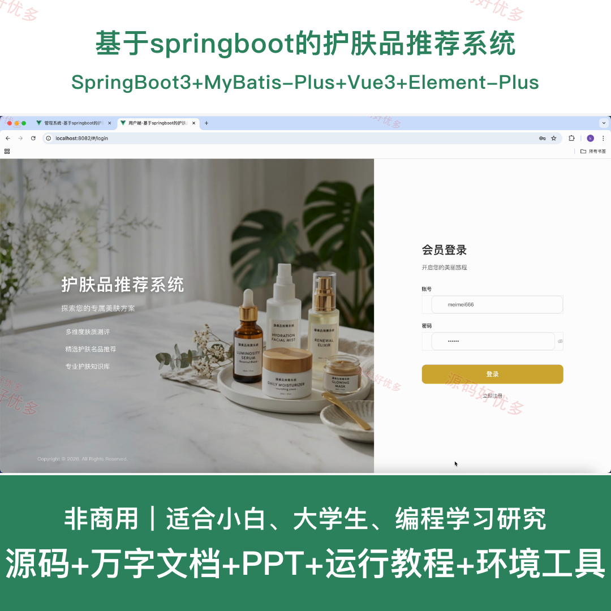
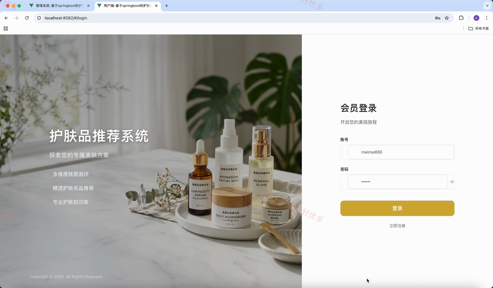
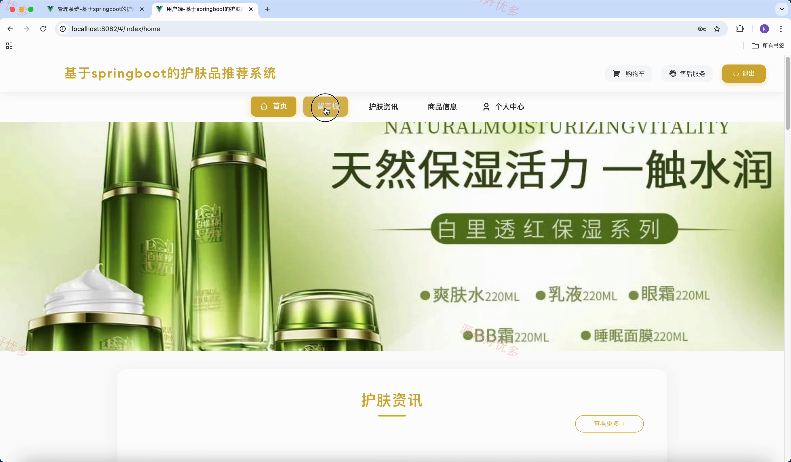
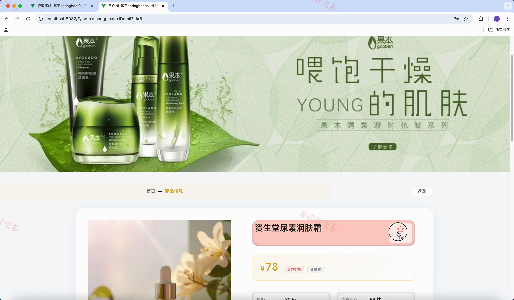
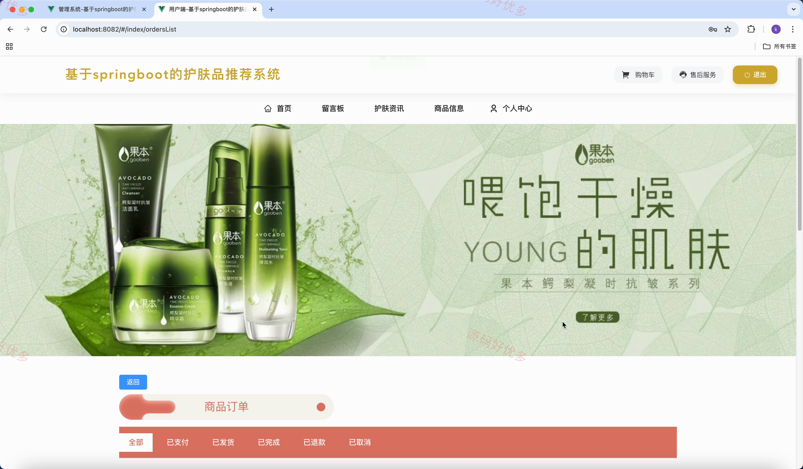
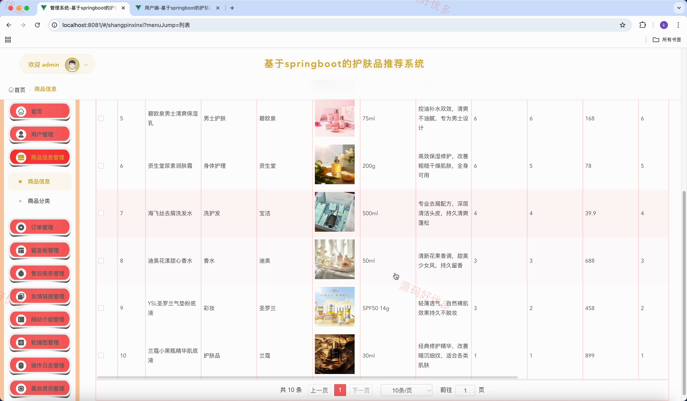
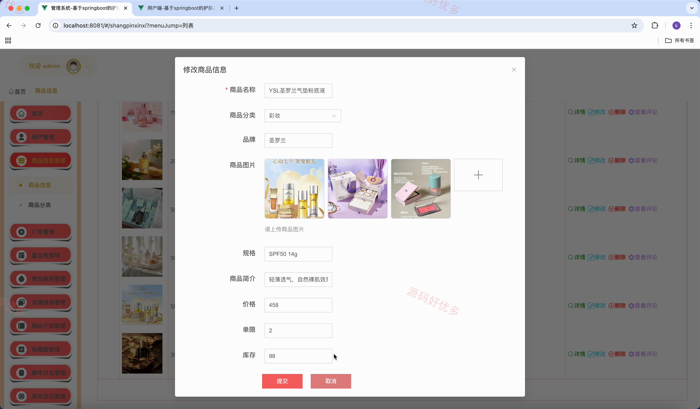
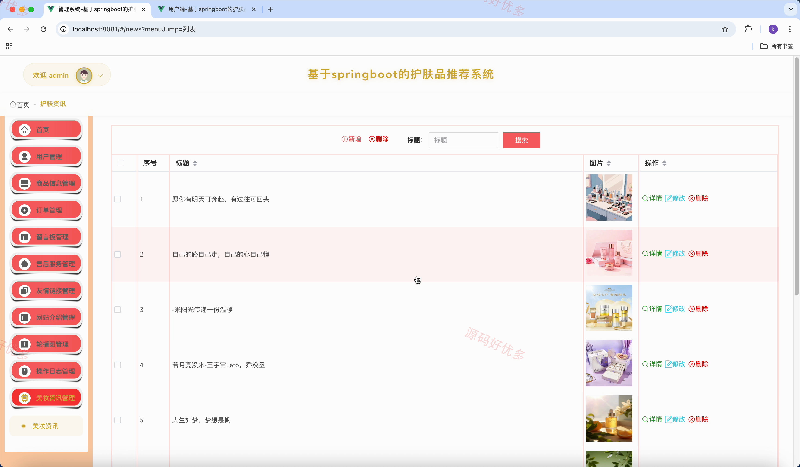
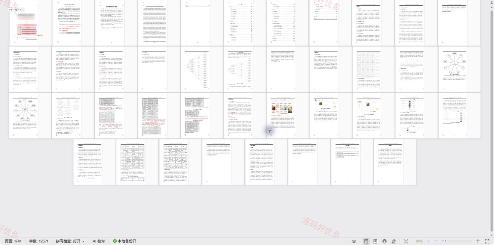

## 源码问题查看主页咨询

### 一、关键词
护肤品推荐系统、护肤品推荐、护肤品推荐信息管理、护肤品推荐后台管理

### 二、作品包含
源码+数据库+万字设计文档+PPT+全套环境和工具资源+本地部署教程

### 三、项目技术
前端技术： Html、Css、Js、Vue3.2、Element-Plus
后端技术：Java、SpringBoot3.3.0、MyBatis-Plus

### 四、运行环境（以下版本亲测，其他版本兼容性请自行测试）
开发工具：IDEA/eclipse + VSCODE

数据库：MySQL8.0+（共18张表）

数据库管理工具：Navicat10以上版本

环境配置软件： JDK17 + Maven3.6.3

前端Nodejs：16+

浏览器：谷歌浏览器

### 五、项目介绍
项目编号：springbootA690D

基于springboot的护肤品推荐系统面向管理员、用户，提供商品信息管理、订单管理、留言板管理、售后服务管理、友情链接管理、网站介绍管理、轮播图管理等功能，实现各角色在系统中的实际业务协作。

角色：管理员、用户

管理员功能：后台登录、用户管理、商品与分类管理、订单与售后管理、留言板管理、友情链接与网站介绍管理、轮播图与美妆资讯管理、操作日志管理。

用户功能：登录注册与个人中心维护、美妆资讯与商品浏览、商品收藏与评价、购物车管理与提交订单、收货地址管理、订单支付取消及退款、订单物流确认收货及评价、留言及售后服务。

### 六、运行截图

